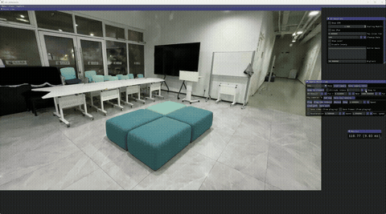
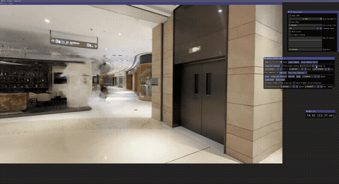
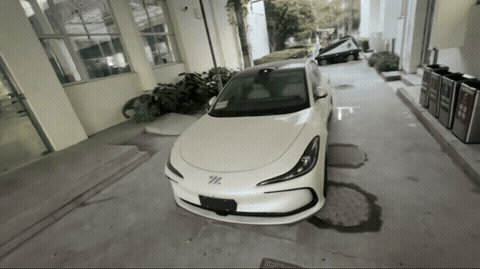

# 3DGS Real Scene Reconstruction

&gt; 基于手机视频与 RealSense D435i 的多源真实场景 3DGS 重建实践。
&gt; 覆盖学院楼层、商场、车辆周围等多尺度场景，用于人形机器人仿真环境部署。

## 📹 Reconstruction Demos

### Scene 1: Hall 1F (Large-scale Indoor)
| Preview | Method |
|---------|--------|
|  | Hierarchical3DGS |

### Scene 2: Mall Scene (Complex Texture)
| Preview | Method |
|---------|--------|
|  | Hierarchical3DGS |

### Scene 3: Vehicle Surround
| Preview | Method |
|---------|--------|
|  | Traditional 3DGS |

## 🔧 Data Pipeline
- **采集**: Phone video (4K) + RealSense D435i RGB-D stream
- **标定**: Camera intrinsic/extrinsic calibration & world-to-image projection
- **对齐**: RGB-D spatiotemporal registration and synchronization
- **重建**: SfM initialization (COLMAP) → offline 3DGS optimization / real-time SLAM tracking

## 📊 Tech Stack
3DGS | RealSense D435i | OpenCV | COLMAP | PyTorch | Hierarchical3DGS | MemGS | LEGO-SLAM | ROS/ROS2 | Ubuntu